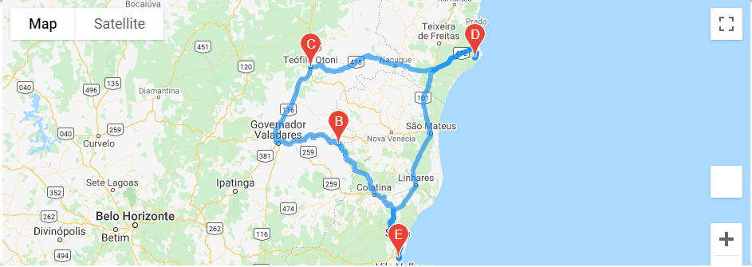
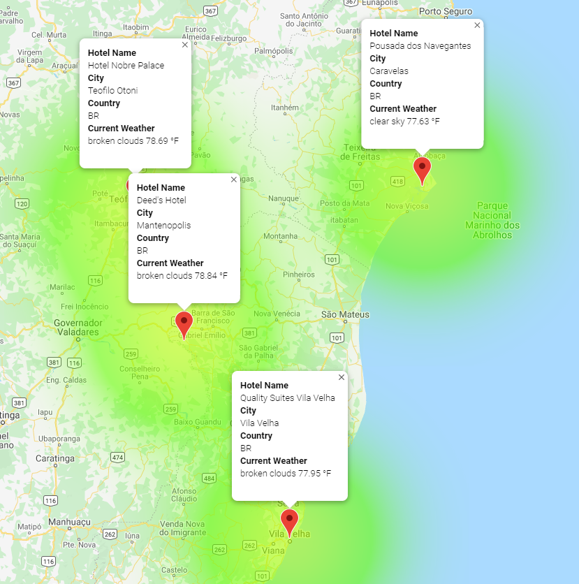

# World Weather Analysis

## Overview of the World Weather Analysis

### Purpose

##### The purpose of Module Six and the World Weather Analysis is to utilize Python, decision and repetition statements, data structures, Pandas, Matplotlib, and SciPy statistics to retrieve and use data from OpenWeatherMap and Google Map API's to "get" request to a server, retrieve and store values from a JSON array, use try and except blocks to resolve errors, create and format scatter plots using Matplotlib, perform linear regression and add regression lines to scatter plots, and use a Google API to create heatmaps.

